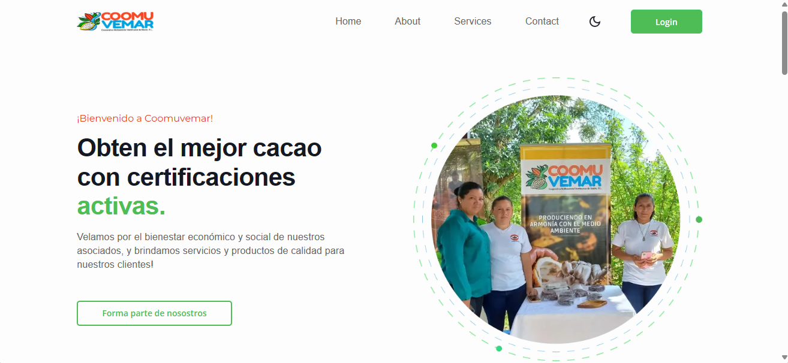
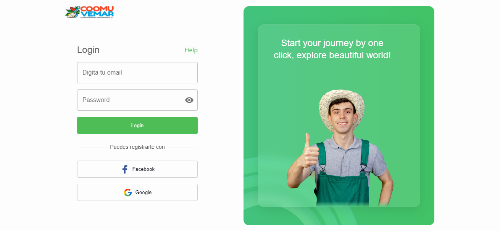

## Aplicacion Frontend Cooperativa COOMUVEMAR.

[](https://app.travis-ci.com/margothgarth/coomuvemar-frontend)


En el desarrollo de la aplicación web se usará TypeScript que es un lenguaje de programación fuertemente tipado que se basa en JavaScript, lo que le brinda mejores herramientas a cualquier escala. se hará uso de NextJS v13, un Framework de JavaScript hecho para construir aplicaciones React renderizadas del lado del servidor, este es de código abierto y facilita enormemente la creación de aplicaciones web, para la creación de las interfaces se utilizará Material UI que es una librería de componentes de ReactJS que brinda una serie de componentes visuales para que el desarrollo sea más rápido y sencillo.

## Para empezar.

This is a [Next.js](https://nextjs.org/) project bootstrapped with [`create-next-app`](https://github.com/vercel/next.js/tree/canary/packages/create-next-app).

Primero tienes que clonar el repositorio.
```
git clone https://github.com/Maynor125/commuvemar-frontend.git
```

Luego instala las dependencias.
```bash
npm install --save
# or
yarn install --save
# or
pnpm install --save
```

Luego inicia el servidor de desarrollo:

```bash
npm run dev
# or
yarn dev
# or
pnpm dev
```
Listo ya puedes usar la aplicacion.




## Caracteristicas

1. **Landing Page**: Página de entrada del sitio web, que proporciona informacion de la cooperativa.
2. **Autenticación**: Sistema de autenticación de usuarios.
3. **Dashboard**: Panel de control con resumen de información relevante.
4. **Administración de la ficha de inspección**: Herramienta para gestionar y editar las fichas de inspección.
5. **Historial de las fichas levantadas**: Registro de todas las fichas de inspección anteriores.
6. **Administración de productores**: Gestión de los datos de los productores.
7. **Administración de inspectores**: Gestión de los datos de los inspectores.
8. **Asignación de productores a visitar**: Funcionalidad para asignar productores a los inspectores para su visita.


## Licencia

Este proyecto está bajo la [Licencia GPL (GNU General Public License)](https://www.gnu.org/licenses/gpl-3.0.html).

## Contribuir

¡Gracias por querer contribuir en este proyecto! Aquí tienes cómo puedes hacerlo:

1. Forkea y clona el repositorio.
2. Crea una rama para tu contribución.
3. Haz tus cambios y haz commit.
4. Haz push a tu rama y envía un pull request.
5. Si tienes preguntas o sugerencias, abre un issue.

¡Esperamos tus contribuciones!

